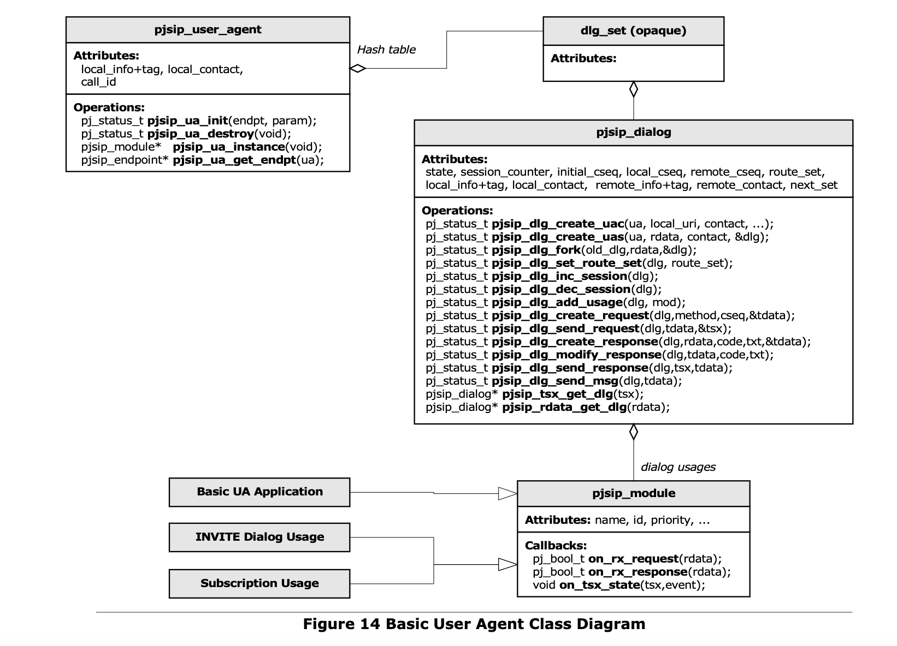

## **Dialog**



### **Dialog Structure**

```c
 // This structure is used to describe dialog's participants, local and remote party.
struct pjsip_dlg_party
{
    pjsip_fromto_hdr *info; // From/To header, inc tag
    pj_uint32_t tag_hval; // Hashed value of the tag
    pjsip_contact_hdr *contact; // Contact header.
    pj_int32_t first_cseq; // First CSeq seen.
    pj_int32_t cseq; // Next sequence number.
};
// This structure describes basic dialog.
struct pjsip_dialog
{
    PJ_DECL_LIST_MEMBER(pjsip_dialog); // List node in dialog set.
// Static properties:
   char obj_name[PJ_MAX_OBJ_NAME]; // Log identification
    pj_pool_t *pool; // Dialog’s memory pool.
    pj_mutex_t *mutex; // Dialog's mutex.
    pjsip_user_agent *ua; // User agent instance.
    void *dlg_set; // The dialog set.
// Dialog session properties.
    pjsip_uri *target; // Current target.
    pjsip_dlg_party local; // Local party info.
    pjsip_dlg_party remote; // Remote party info.
    pjsip_role_e role; // Initial role.
    pj_bool_t secure; // Use secure transport?
    pjsip_cid_hdr *call_id; // Call-ID header.
    pjsip_route_hdr route_set; // Route set list.
    pjsip_auth_clt_sess auth_sess; // Client authentication session.
// Session Management
    int sess_count; // Session counter.
    int tsx_count; // Active transaction counter.
// Dialog usages
    unsigned usage_cnt; // Number of registered usages.
    pjsip_module *usage[PJSIP_MAX_MODULE]; // Usages, priority sorted
// Module specific data.
    void *mod_data[PJSIP_M AX_MODULE];
}
```

