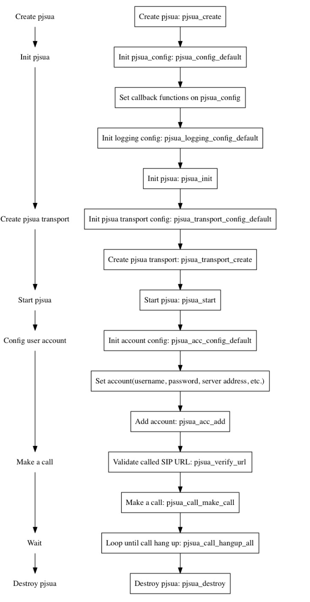
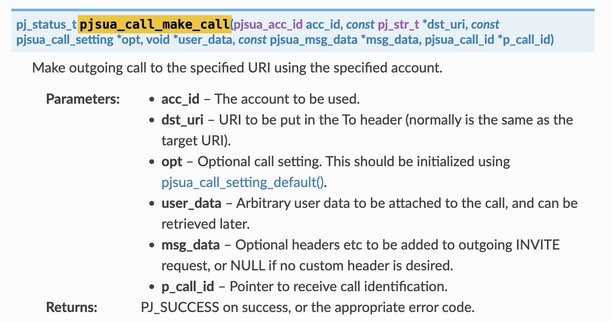

## simple_pjsua.c流程



## pjsua_call_make_call



```c
status = pjsua_call_make_call(acc_id, &uri, 0, NULL, NULL, NULL);
```

**参数:**

**acc_id ** 获得

```
pjsua_acc_add(&cfg, PJ_TRUE, &acc_id);
```

**uri** 用户传入

```
pj_str_t uri = pj_str(argv[1]);
```


## pjsip_dlg_create_uac

```c
pj_status_t pjsip_dlg_create_uac(pjsip_user_agent *ua, const pj_str_t *local_uri, const pj_str_t *local_contact, const pj_str_t *remote_uri, const pj_str_t *target, pjsip_dialog **p_dlg)
```

Create a new dialog and return the instance in p_dlg parameter. After creating the dialog, application can add modules as dialog usages by calling #pjsip_dlg_add_usage(). If the request has To tag parameter, dialog's local tag will be initialized from this value. Otherwise a globally unique id generator will be invoked to create dialog's local tag. This function also initializes the dialog's route set based on the Record-Route headers in the request, if present. Note that initially, the session count in the dialog will be initialized to zero.

**参数:**
`ua` – The user agent module instance.
`local_uri` – Dialog local URI (i.e. From header).
`local_contact` – Optional dialog local Contact to be put as Contact header value, hence the format must follow RFC 3261 Section 20.10: When the header field value contains a display name, the URI including all URI parameters is enclosed in "<" and ">". If no "<" and ">" are present, all parameters after the URI are header parameters, not URI parameters. The display name can be tokens, or a quoted string, if a larger character set is desired. If this argument is NULL, the Contact will be taken from the local URI.
`remote_uri` – Dialog remote URI (i.e. To header).
`target` – Optional initial remote target. If this argument is NULL, the initial target will be set to remote URI.
`p_dlg` – Pointer to receive the dialog.

**返回:**
PJ_SUCCESS on success.