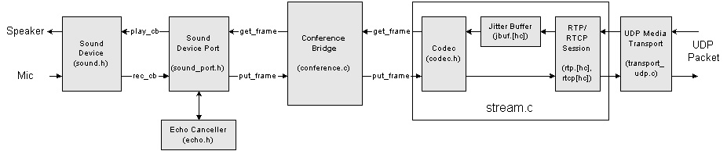

## 初始化全流程思考

一个transport 一个 stream一个port两个channel，

一、再开启invite session之前

1. 创建media endpoint
2. 创建transport放在g_med_transport数组，注册绑定socket

二、loop处理sip事件

三、SDP协商完后回调

1. 创建stream，先获取stream_info（从sdp协商中pjmedia_stream_info_from_sdp）

   - 1、申请媒体流空间

     2、初始化流的若干参数

     3、codec管理者及codec相关的操作

     4、设置第一组回调put_frame和get_frame，这组回调是音频设备port要用的

     5、创建jitterbuffer，这个后面会单独讲

     6、创建编码通道和解码通道

     7、调用上一节中提到的媒体传输attach，传入第2组回调on_rx_rtp和on_rx_rtcp

2. pjmedia_stream_start，channel开，Start the audio stream

   编码通道和解码通道pause =0；

3. pjmedia_transport_media_start，UDP media transport开

   Start the audio stream，tp->start = 1  

4. port创建，创建设备，开启设备  Open audio stream object

Callback when SDP negotiation has completed.